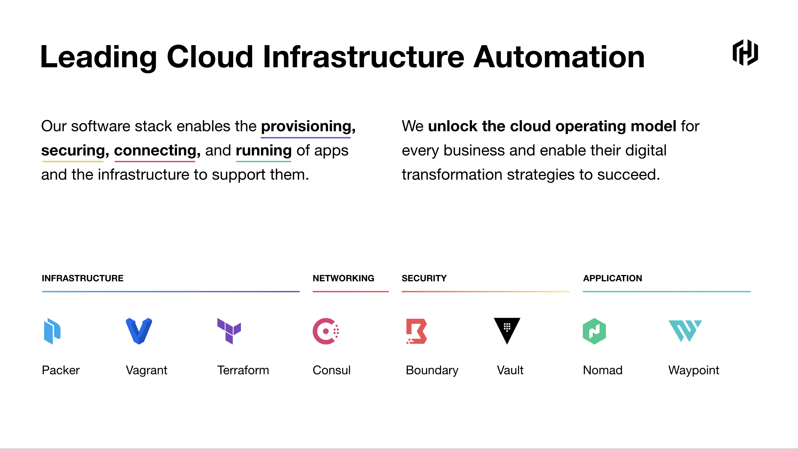
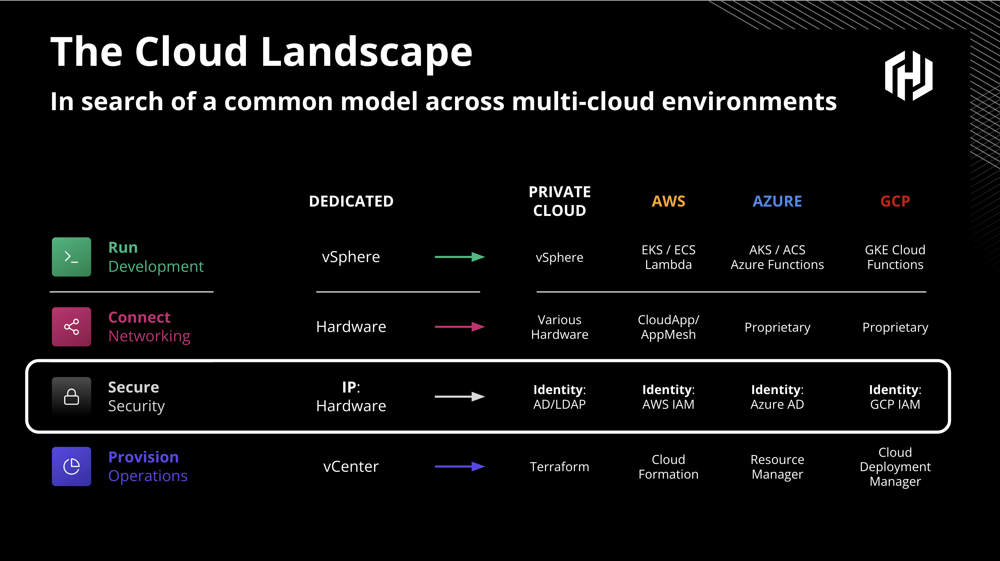
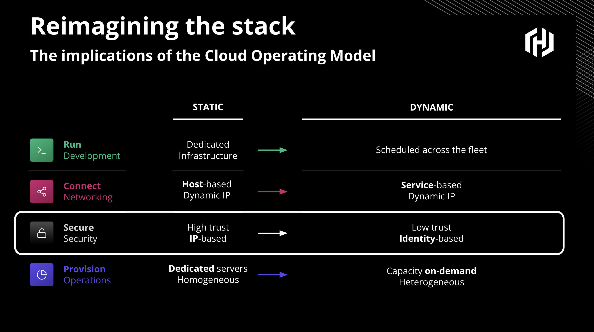

name: chapter-1
class: title, shelf, no-footer, fullbleed
background-image: url(https://hashicorp.github.io/field-workshops-assets/assets/bkgs/HashiCorp-Title-bkg.jpeg)
count: false

# Chapter 1  
## HashiCorp & Vault Overview

???
Chapter 1 introduces HashiCorp & Vault

---
name: hashiCorp-overview
# Who is HashiCorp?

???
This is meant as a high level overview.  For detailed descriptions or instructions please see the docs, API guide, or learning site:
* https://www.vaultproject.io/docs/
* https://www.vaultproject.io/api/
* https://learn.hashicorp.com/vault/

---
name: HashiCorp-Intro1
.center[]

???
**We build tools for practitioners, and these are used extensively. There’s a good chance engineers at your company use our tools today; many of these projects have been downloaded millions of times. They are foundational tools for the most important workflows for organizations large and small.**

---
name: HashiCorp-Intro2
.center[]

???
**In the old world, secrets management was easy. There was a single ID provider, usually AD, and everything was safely secured in a high trust “walled garden”.
Workloads are now highly distributed, no longer protected by the castle / moat of the past. 
May have had just a single identity provider, AD.
Datacenter was secured at the perimeter with high trust in the middle.**

---
name: HashiCorp-Intro3
.center[]

???
**Your applications - systems of record running on-prem, and systems of engagement running in elastic public clouds - are now running on dynamic infrastructure. These clouds support a rapid pace of change, which is fantastic for innovation. This shift is happening everywhere. And as organizations dig in to this shift, things are even more complicated in a multi-cloud world.**

---
name: HashiCorp-Intro4
.center[]

???
**Provision: each has a unique tool to provision fleets of any size on-demand**

??? **Secure: each has a distinct IDENTITY model**
??? **Connect: each has a proprietary networking model which has given rise to the need for Service-based overlay models**
??? **Run: they all have multiple offerings here. Container-based offerings are key, but they also all are investing heavily in emerging concepts such as Serverless which represent the logical evolution at that layer.**
??? **The challenge then for any enterprise Ops and Security team is: how do I reconcile this reality?**

---
name: the-old-way
layout: false
# The Traditional Security Model
.center[]
.center[Also known as the "Castle and Moat" method.]

???
* This picture shows the traditional castle and moat security model.

---
name: traditional-security-models
# The Traditional Security Model
* Traditional security models were built upon the idea of perimeter based security.
* There would be a firewall, and inside that firewall it was assumed one was safe.
* Resources such as databases were mostly static.  As such rules were based upon IP address, credentials were baked into source code or kept in a static file on disk.

???
This slide discusses the traditional security model

---
name: problems-with-traditional-security-models
# Problems with the Traditional Security Model
* IP Address based rules
* Hardcoded credentials with problems such as:
  * Shared service accounts for apps and users
  * Difficult to rotate, decommission, and determine who has access
  * Revoking compromised credentials could break things

---
name: the-new-way
layout: false
# Modern Secrets Management
.center[]
.center[No well defined perimeter; security enforced by identity.]

???
* These are Mongolian Yurts or "Ger" as they are called locally. Instead of a castle with walls and a drawbridge, a fixed fortress that has an inside and an outside, these people move from place to place, bringing their houses with them.

* And if you don't think the Nomadic way can be an effective security posture, think about this for a moment. The Mongol military tactics and organization enabled the Genghis Khan to conquer nearly all of continental Asia, the Middle East and parts of eastern Europe. Mongol warriors would typically bring three or four horses with them, so they could rotate through the horses and go farther. Mongol army units could move up to 100 miles a day, which was unheard of in the 13th century. They were faster, more adaptable, and more resilient than all their enemies.

---
name: hashiCorp-vault-overview
# HashiCorp Vault: Modern Secrets Management

  * Vault is an API-driven, cloud/environment agnostic secrets management system.
  * It allows you to safely store and manage sensitive data in single, hybrid, and multi-cloud environments.
  * You can also use Vault to generate dynamic short-lived credentials, or encrypt application data on the fly.

???
This is meant as a high level overview.  For detailed descriptions or instructions please see the docs, API guide, or learning site:
* https://www.vaultproject.io/docs/
* https://www.vaultproject.io/api/
* https://learn.hashicorp.com/vault/
---
name: HashiCorp-Intro5
.center[]

???
**There’s a bit more to the picture too. Each cloud may be different, but they do all have one thing in common: they support a new control point at each layer.**
???
**This just underscores how architectures are different in a dynamic world.**

??? **Instead of monolith apps deploying to a web server every few months, you have containers delivered continuously.**
??? **Networking now revolves around loosely coupled services, and a service registry is the foundation for modern cloud networking.**
??? **Security is now about “who” you are, not “where” you are.**
??? **And Infrastructure as code enables the rapid provisioning and automation that supports everything above it.**

??? **How can you account for the differences in APIs with the similarity in control point? That’s exactly what HashiCorp has done.**

---
name: HashiCorp-Intro6
.center[]

???
**So, How do you interface with multi-cloud infrastructure with consistency? You establish central shared service platform with a single control plane.**

??? **Your goal should be to establish a central shared service platform with a single control plane, across all four of these layers.**
??? **What’s happening is each cloud infrastructure has a different API for each of these four layers. Different technologies native to each island of compute.**

??? **Which brings us to the Cloud Operating Model.**

**

---
name: HashiCorp-Intro7
.center[]

???
**It's really an approach to enable all of your teams to run provisioning, security, networking, and runtime through a single control plane at every layer. This approach helps all of your developers and practitioners to be more productive, and it connects them in meaningful ways to the cloud that matter.**

---
name: HashiCorp-Intro8

.center[<h2>How does Vault solve the challenges that come with the traditional security model?]

???
**The Cloud Operating Model is a fantastic way to unify many different parts of your cloud strategy. And that's exactly what we're going to focus on today: How to simplify cloud infrastructure deployments with Terraform**

---
name: HashiCorp-Intro9
.center[]

???
**The Cloud Operating Model is a fantastic way to unify many different parts of your cloud strategy. And that's exactly what we're going to focus on today: How to simplify cloud infrastructure deployments with Terraform**

---
name: identity-based-security-2
# Identity Based Security

Vault was designed to address the security needs of modern applications.  It differs from the traditional approach by using:

* Identity based rules allowing security to stretch across network perimeters
* Dynamic, short lived credentials that are rotated frequently
* Individual accounts to maintain provenance (tie action back to entity)
* Credentials and Entities that can easily be invalidated

???
* This slide discusses how Vault is designed for modern applications.

---
name: identity-based-security-1
#Identity Based Security
.center[]
.center[[Identity Based Security and Low Trust Networks](https://www.hashicorp.com/identity-based-security-and-low-trust-networks)
]

???
* Here we see that Vault has multiple means of authenticating users and applications with its Auth Methods.
* Vault can manage many types of secrets and excels at generating short-lived, dynmamic secrets.
* Vault's ACL policies are associated with tokens that users and applications use to access secrets after authenticating.
* Tokens can only read/write secrets that its policies allow.
* Click on the link to read a white paper about identity-based security in low trust networks.

---
name: HashiCorp-Intro9
.center[]

???
**The Cloud Operating Model is a fantastic way to unify many different parts of your cloud strategy. And that's exactly what we're going to focus on today: How to simplify cloud infrastructure deployments with Terraform**

---
name: HashiCorp-Intro9
.center[]

???
**The Cloud Operating Model is a fantastic way to unify many different parts of your cloud strategy. And that's exactly what we're going to focus on today: How to simplify cloud infrastructure deployments with Terraform**

---
name: HashiCorp-Intro9
.center[]

???
**The Cloud Operating Model is a fantastic way to unify many different parts of your cloud strategy. And that's exactly what we're going to focus on today: How to simplify cloud infrastructure deployments with Terraform**

---
name: HashiCorp-Intro9
.center[]

???
**The Cloud Operating Model is a fantastic way to unify many different parts of your cloud strategy. And that's exactly what we're going to focus on today: How to simplify cloud infrastructure deployments with Terraform**

---
name: HashiCorp-Intro9
.center[]

???
**The Cloud Operating Model is a fantastic way to unify many different parts of your cloud strategy. And that's exactly what we're going to focus on today: How to simplify cloud infrastructure deployments with Terraform**

---
name: HashiCorp-Intro9
.center[]

???
**The Cloud Operating Model is a fantastic way to unify many different parts of your cloud strategy. And that's exactly what we're going to focus on today: How to simplify cloud infrastructure deployments with Terraform**

---
name: secrets-engines
layout: false
# Vault Secrets Engines
.center[]
.center[[Vault Secrets Engines](https://www.vaultproject.io/docs/secrets/)]

???
* Vault provides many out-of-the-box secrets engines.
* Additional custom secrets engines can be added by customers.
* Click on the link to learn more about Vault secrets engines.

---
name: vault-deployment-options-1
# Vault Deployment Options

<h3><b>OSS</b></h3>
<ul>
<li>Dynamic secrets 
 Management</li>
<li>Encryption & data protection</li>
<li>Community support</li>
</ul>

<h3><b>Enterprise</b></h3>

<ul>
<li>24/7/365 Support & SLAs</li>
<li>Multi-tenancy</li>
<li>FIPS 140-2 Compliant</li>
<li>Multi-Factor Authentication (Okta, TOTP, more)</li>
<li>DR/HA</li>
<li>HSM Integration</li>
<li>Governance & Policy</li>
<li>and more</li>
</ul>

???
* Click the link to learn more about the internal's of Vault's architecture.

---
name: vault-reference-architecture-2
# Vault Architecture - High Availability
.center[]
.center[[Vault High Availability](https://www.vaultproject.io/docs/concepts/ha/)
]

???
* Vault allows multiple servers to be combined in a highly available cluster within a single cloud region or physical data center.
* Click on the link to learn more about Vault's high availability in a single cluster.

---
name: vault-reference-architecture-3
# Vault Architecture - Multi-Region
.center[]
.center[[Vault Enterprise Replication](https://www.vaultproject.io/docs/enterprise/replication/)
]

???
* Vault Enterprise supports replication between clusters across regions and data centers.
* It supports Disaster Recovery and Performance replication.
* These can be used together.
* Click the link to learn more about Vault's replication.

---
name: chapter-1-review-question
# 📝 Chapter 1 Review

* What is HashiCorp Vault?

???
* Let's review what we learned in this chapter.
---
name: chapter-1-review-answer
# 📝 Chapter 1 Review
* What is HashiCorp Vault?
  * Vault is a Secrets Management System.
  * It is API-driven and cloud agnostic.
  * It can be used in untrusted networks.
  * It can authenticate users and applications against many systems.
  * It supports dynamic generation of short-lived secrets.
  * It runs in highly available clusters that can be replicated across regions.

???
* Here are the answers to the review questions.
